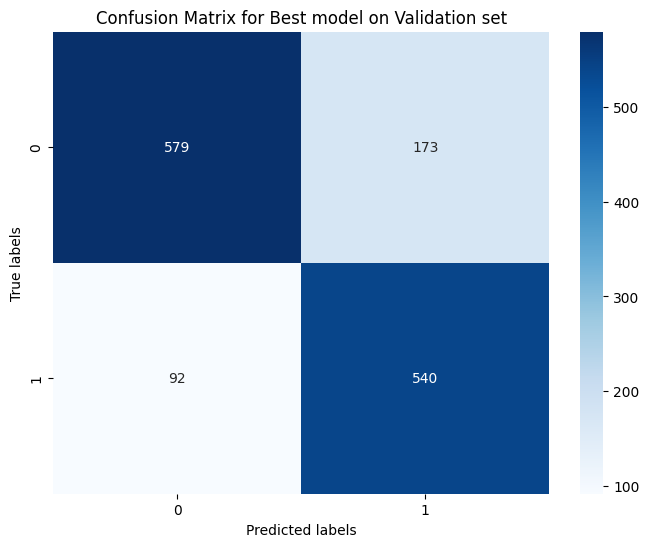
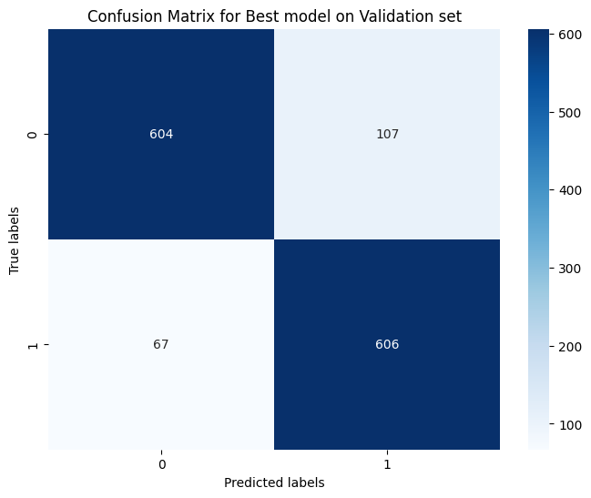

# Assignment 7 - Model Checkpointing

Team 25, Members:

| Name               | Roll Number |
| ------------------ | ----------- |
| Romit Mohane       | 23110279    |
| Rudra Pratap Singh | 23110281    |

## Introduction

This assignment aims to learn about text classification tasks for checkpoint creation.

---

### Code in [Notebook](./STTAI_Lab7.ipynb)

---

### Screenshots

> Model architecture.  
> 

> Hyperparameters  
> **Case 1: BoW**  
>   
> _Number of max features for vectorizer_  
>   
> _Batch size and lr for dataset 1_  
>   
> _Batch size and lr with previous best model's checkpoint On IMDB (dataset 2)_   > **Case 2: BERT**  
>   
> _Batch Size for the tokenizer_  
> 
> 
> _Batch size and lr for dataset 1_
> 
> 
> _Batch size and lr for dataset 2_

> Logged Metrics
> **Case 1: BoW**  
>   
> _Metrics while training on dataset 1_  
>   
> _Metrics while training (using best trained model checkpoint) on dataset 2_ 
> **Case 2: BERT**  
>  
> _Metrics while training on dataset 1_    
>     
> _Metrics while training (using best trained model checkpoint) on dataset 2_   

> Confusion matric visualisations  
> **Case 1: BoW**  
>   
> _Confusion matrix for best model on dataset 1 Validation set_  
>   
> _Confusion matrix for best model (from pretrained best checkpoint) on dataset 2 Validation set_  
> **Case 2: BERT**  
>  
> _Confusion matrix for best model on dataset 1 Validation set_
>  
> _Confusion matrix for best model (from pretrained best checkpoint) on dataset 2 Validation set_

> Training and validation loss curves.  
> **Case 1: BoW**  
>   
> Curves for training on Dataset 1  
>   
> Curves for ReSuMe training on Dataset 2 (IMDB)   
> **Case 2: BERT**  
>  
> Curves for training on Dataset 1  
>  
> Curves for ReSuMe training on Dataset 2 (IMDB)

> Tensorboard Integration (Final Evaluation)  
   
_You can see the tensorboard integration of the models metrics on colab_   
>    
> _Train Loss plot and comparison_   
>    
> _Validation Loss plot and comparison_   
>    
> _Validition Accuracy plot and comparison_   

**Final Validation Accuracies**

| Method          | Dataset 1 | Dataset 2 |
| --------------- | --------- | --------- |
| BoW             | ~80%      | ~89%      |
| BERT Embeddings | ~87%      | ~87.5%    |

> Checkpoint Compression  
>   
> _Here you can see we are saving the checkpoint as a compressed zip file, and then reading from it as well._
